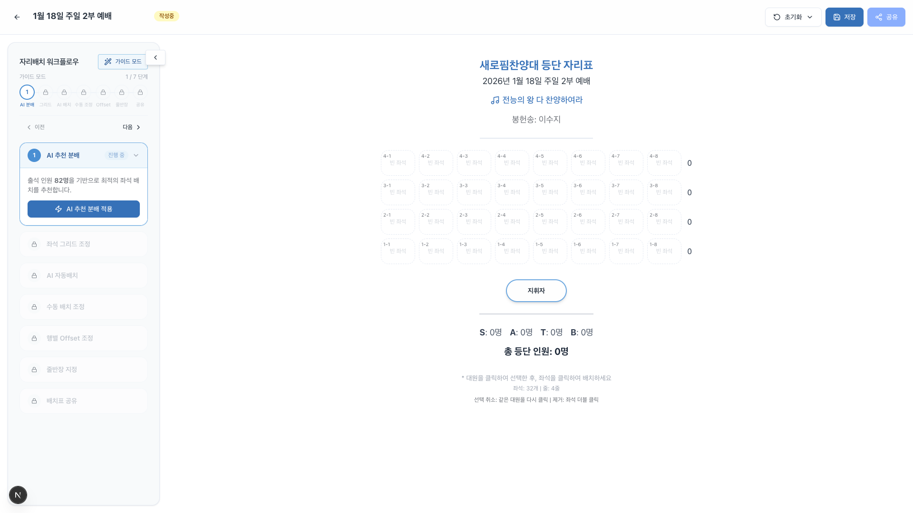
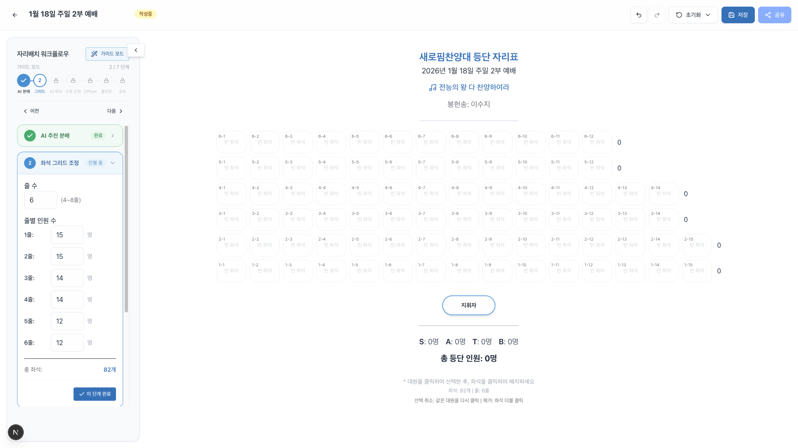
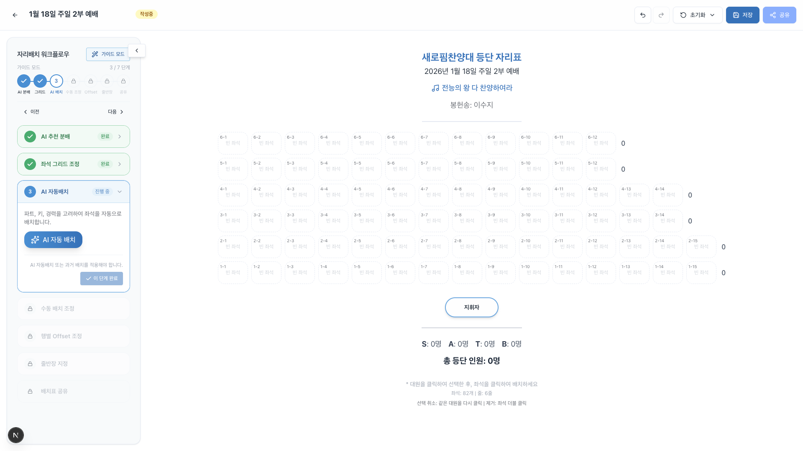
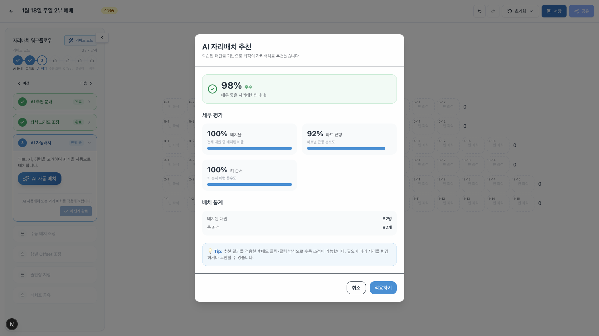
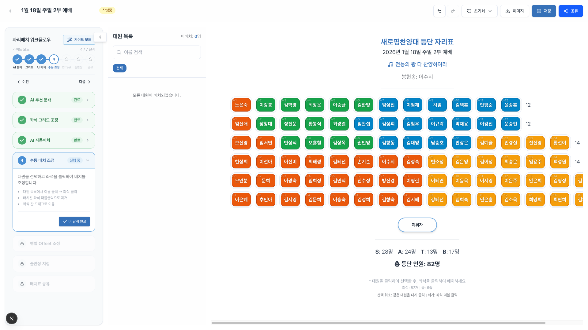
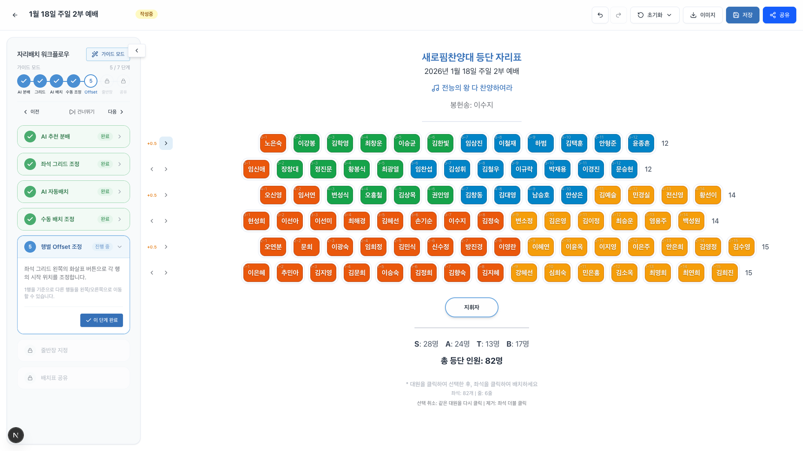
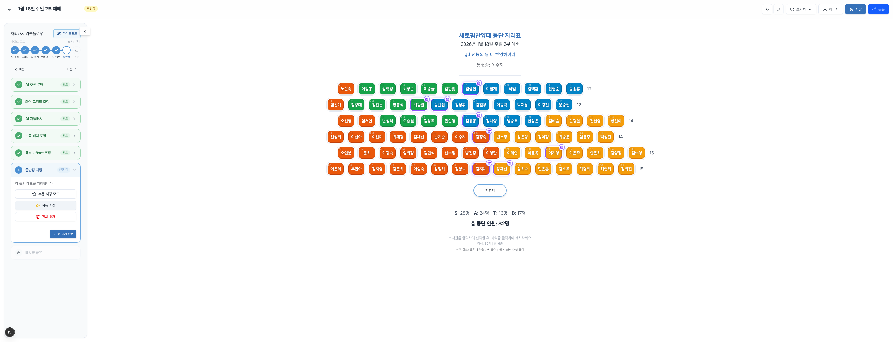
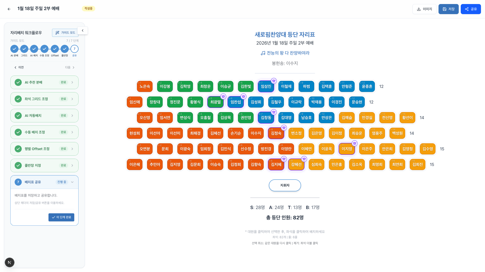

# 새로핌찬양대 자리배치 시스템 사용설명서

> **버전**: 1.0
> **최종 수정일**: 2026년 1월 24일
> **대상**: 지휘자, 파트장, 관리자

---

## 목차

1. [개요](#1-개요)
2. [시작하기](#2-시작하기)
3. [7단계 워크플로우](#3-7단계-워크플로우)
   - [Step 1: AI 추천 분배](#step-1-ai-추천-분배)
   - [Step 2: 좌석 그리드 조정](#step-2-좌석-그리드-조정)
   - [Step 3: AI 자동배치](#step-3-ai-자동배치)
   - [Step 4: 수동 배치 조정](#step-4-수동-배치-조정)
   - [Step 5: 줄 정렬 조정](#step-5-행별-offset-조정)
   - [Step 6: 줄반장 지정](#step-6-줄반장-지정)
   - [Step 7: 배치표 공유](#step-7-배치표-공유)
4. [최근 업데이트 내역](#4-최근-업데이트-내역)
5. [자주 묻는 질문](#5-자주-묻는-질문)

---

## 1. 개요

자리배치 시스템은 **출석 투표 결과를 기반으로** 찬양대 등단 자리를 효율적으로 배치할 수 있도록 도와주는 도구입니다.

### 주요 특징

- **AI 기반 추천**: 과거 배치 데이터를 학습하여 최적의 줄별 인원 분배와 좌석 배치를 추천합니다.
- **7단계 가이드 워크플로우**: 처음 사용자도 쉽게 따라할 수 있는 단계별 안내를 제공합니다.
- **실시간 편집**: 드래그 앤 드롭 없이 클릭-클릭 방식으로 빠르게 배치를 조정할 수 있습니다.
- **이미지 캡처 및 공유**: 완성된 배치표를 이미지로 저장하고 카카오톡 등으로 공유할 수 있습니다.

---

## 2. 시작하기

### 2.1 자리배치 페이지 접근

1. 상단 메뉴에서 **"자리배치"**를 클릭합니다.
2. 배치표 목록에서 작업할 날짜의 배치표를 선택하거나, **"새 배치표 만들기"** 버튼을 클릭합니다.

### 2.2 워크플로우 모드 선택

자리배치 시스템은 두 가지 모드를 제공합니다:

| 모드 | 설명 | 추천 대상 |
|------|------|----------|
| **위자드 모드** (기본) | 1단계부터 7단계까지 순서대로 진행하며, 각 단계 완료 시 다음 단계로 자동 이동합니다. | 처음 사용자, 체계적인 작업을 원하는 사용자 |
| **자유 모드** | 모든 단계를 자유롭게 왔다 갔다 하며 작업할 수 있습니다. | 숙련된 사용자, 특정 단계만 수정하고 싶을 때 |

모드 전환은 워크플로우 패널 상단의 **"위자드 모드"** 토글 버튼을 클릭하면 됩니다.

---

## 3. 7단계 워크플로우

### Step 1: AI 추천 분배

> **목표**: 출석 인원에 맞는 최적의 줄 수와 줄별 인원을 결정합니다.



#### 사용 방법

1. 워크플로우 패널에서 **"Step 1: AI 추천 분배"** 섹션을 펼칩니다.
2. **"AI 추천 분배 (N명)"** 버튼을 클릭합니다.
   - N은 해당 주일에 출석 투표한 인원 수입니다.
3. AI가 과거 배치 데이터를 분석하여 최적의 줄 구성을 추천합니다.

#### 추천 결과 예시

| 출석 인원 | 추천 줄 수 | 줄별 인원 |
|----------|-----------|----------|
| 35명 | 5줄 | 7-7-7-7-7 |
| 42명 | 6줄 | 7-7-7-7-7-7 |
| 50명 | 6줄 | 8-8-8-9-9-8 |

#### 팁

- AI 추천은 **시작점**일 뿐입니다. Step 2에서 자유롭게 조정할 수 있습니다.
- 출석 인원이 적은 날에는 줄 수를 줄여 밀도 있는 배치를 권장합니다.

---

### Step 2: 좌석 그리드 조정

> **목표**: AI 추천 결과를 바탕으로 줄 수와 줄별 인원을 미세 조정합니다.



#### 조정 가능한 항목

| 항목 | 설명 | 범위 |
|------|------|------|
| **줄 수** | 전체 줄의 개수 | 3~8줄 |
| **줄별 인원** | 각 줄에 배치할 좌석 수 | 0~15명 |

#### 사용 방법

1. **줄 수 조정**: 숫자 입력란에 원하는 줄 수를 입력합니다.
2. **줄별 인원 조정**: 각 줄 옆의 숫자 입력란에 원하는 인원을 입력합니다.

#### 화면 구성

```
줄 수: [5] (3~8줄)

줄별 인원 수:
  1줄: [7] 명
  2줄: [8] 명
  3줄: [7] 명
  4줄: [8] 명
  5줄: [7] 명

총 좌석: 37개
⚠ 출석 인원(35명)과 총 좌석(37개)이 일치하지 않습니다
```

#### 팁

- 총 좌석 수가 출석 인원보다 **2~3개 많게** 설정하면 여유 있게 배치할 수 있습니다.
- 경고 메시지가 표시되어도 문제없이 진행할 수 있습니다.

---

### Step 3: AI 자동배치

> **목표**: 파트, 키, 경력을 고려하여 좌석을 자동으로 배치합니다.



**AI 추천 결과 미리보기:**



#### AI 배치 기준

1. **파트 그룹핑**: 같은 파트끼리 모여 배치됩니다.
   - 일반적으로 소프라노/알토는 왼쪽, 테너/베이스는 오른쪽에 배치됩니다.
2. **키 정렬**: 같은 파트 내에서 키 순으로 정렬됩니다.
   - 앞줄에 키가 작은 대원, 뒷줄에 키가 큰 대원이 배치됩니다.
3. **경력 고려**: 신입 대원은 경력자 옆에 배치되어 도움을 받을 수 있습니다.

#### 사용 방법

1. **"AI 자동 배치"** 버튼을 클릭합니다.
2. AI가 분석을 완료하면 미리보기 창이 표시됩니다.
3. 배치 결과를 확인하고 **"적용"** 버튼을 클릭합니다.

#### 과거 배치 적용

최근 배치를 참고하고 싶다면:
1. **"과거 배치 적용"** 버튼을 클릭합니다.
2. 이전 주일의 배치 목록에서 원하는 배치를 선택합니다.
3. 해당 배치가 현재 배치표에 적용됩니다.

#### 팁

- AI 배치 후에도 Step 4에서 자유롭게 수정할 수 있습니다.
- 과거 배치를 적용한 후, 이번 주 불참자만 제거하고 참석자를 추가하는 것도 좋은 방법입니다.

---

### Step 4: 수동 배치 조정

> **목표**: 클릭-클릭 방식으로 좌석 배치를 미세 조정합니다.



#### 조작 방법

| 동작 | 방법 |
|------|------|
| **대원 선택** | 왼쪽 사이드바에서 대원 이름을 클릭 |
| **좌석에 배치** | 선택한 상태에서 원하는 좌석 클릭 |
| **선택 취소** | 같은 대원을 다시 클릭 |
| **좌석에서 제거** | 배치된 좌석을 더블 클릭 |
| **자리 교환** | 대원 A 선택 → 대원 B가 앉은 좌석 클릭 |

#### 사이드바 구성

왼쪽 사이드바에는 대원 목록이 파트별로 표시됩니다:

```
[미배치 대원]
━━━━━━━━━━━━━━
소프라노 (3)
  ○ 김소프 (163cm)
  ○ 이소프 (158cm)
  ○ 박소프 (160cm)

알토 (2)
  ○ 최알토 (165cm)
  ○ 정알토 (162cm)

[배치 완료 대원]
━━━━━━━━━━━━━━
테너 (5)
  ● 강테너 (175cm)
  ...
```

- **○ (빈 원)**: 아직 배치되지 않은 대원
- **● (채워진 원)**: 이미 배치된 대원

#### 파트별 색상

좌석 그리드에서 각 파트는 다음 색상으로 구분됩니다:

| 파트 | 색상 |
|------|------|
| 소프라노 | 분홍색 |
| 알토 | 주황색 |
| 테너 | 연두색 |
| 베이스 | 하늘색 |

#### 팁

- 모든 대원이 배치될 때까지 "미배치 멤버가 N명 있습니다" 메시지가 표시됩니다.
- 파트 색상을 보면서 균형 잡힌 배치인지 확인하세요.

---

### Step 5: 줄 정렬 조정

> **목표**: 지휘자 시야 확보를 위해 줄 위치를 좌우로 조정합니다.

**Offset 조정 후 (짝수줄 +0.5 이동하여 지그재그 패턴 적용):**



#### Offset이란?

Offset은 각 줄을 **왼쪽 또는 오른쪽으로 이동**시키는 값입니다. 이를 통해 뒷줄 대원이 앞줄 대원 사이로 보이게 하여 지휘자의 시야를 확보합니다.

#### 조정 방법

1. 각 줄 왼쪽에 있는 **좌우 화살표 버튼**을 클릭합니다.
2. 0.25칸 단위로 조정됩니다.

```
     [◀]  ━━━●━━━  [▶]  0.25    1줄
     [◀]  ━━━○━━━  [▶]  기본    2줄
     [◀]  ━━━●━━━  [▶]  0.5     3줄
```

#### 조정 범위

| 값 | 의미 |
|----|------|
| 기본 | 원래 위치 (조정 없음) |
| 0 | 가장 왼쪽 |
| 0.25 | 약간 오른쪽 (1/4칸) |
| 0.5 | 중간 오른쪽 (반칸) |
| 0.75 | 많이 오른쪽 (3/4칸) |

#### 초기화

- 각 줄의 **회전 화살표 아이콘**을 클릭하면 해당 줄이 기본값으로 돌아갑니다.
- **"모두 기본값으로 초기화"** 버튼을 클릭하면 모든 줄의 offset이 초기화됩니다.

#### 팁

- 이 단계는 **선택 사항**입니다. 필요 없으면 "건너뛰기" 버튼을 클릭하세요.
- 일반적으로 짝수 줄을 0.5칸 이동하면 지그재그 패턴이 만들어집니다.

---

### Step 6: 줄반장 지정

> **목표**: 각 줄의 대표 대원을 지정합니다.

**줄반장 자동 지정 후 (별표로 표시됨):**



#### 줄반장의 역할

- 해당 줄의 대원들에게 자리 안내
- 출석 확인 보조
- 찬양 준비 상황 전달

#### 지정 방법

1. 좌석 그리드에서 줄반장으로 지정할 대원의 좌석을 클릭합니다.
2. 컨텍스트 메뉴에서 **"줄반장 지정"**을 선택합니다.
3. 줄반장으로 지정된 대원은 **별표(★)** 표시가 나타납니다.

#### 팁

- 줄반장은 각 줄에 한 명만 지정할 수 있습니다.
- 경력이 있는 대원을 줄반장으로 지정하는 것을 권장합니다.

---

### Step 7: 배치표 공유

> **목표**: 완성된 배치표를 이미지로 저장하고 공유합니다.



#### 저장 및 공유 방법

1. **"이미지 캡처"** 버튼을 클릭합니다.
2. 배치표가 이미지로 변환되어 다운로드됩니다.
3. 파일 이름: `새로핌찬양대_자리표_2026-01-26.png`

#### 캡처 이미지에 포함되는 정보

캡처된 이미지에는 다음 정보가 자동으로 포함됩니다:

**헤더 영역**:
- 새로핌찬양대 등단 자리표 (제목)
- 날짜 및 예배 유형 (예: 2026년 1월 26일 주일예배)
- 찬양곡명 (등록된 경우)
- 봉헌송 연주자 (등록된 경우)

**좌석 그리드**:
- 각 좌석의 대원 이름
- 파트별 색상 구분
- **각 줄별 인원수** (오른쪽에 표시)

**푸터 영역**:
- 파트별 인원수 (S: N명, A: N명, T: N명, B: N명)
- 총 등단 인원

#### 배치표 상태 변경

배치표는 다음 상태를 가집니다:

| 상태 | 설명 |
|------|------|
| **DRAFT** | 작성 중 (수정 가능) |
| **CONFIRMED** | 확정됨 (수정 가능) |
| **SHARED** | 공유됨 (긴급 수정만 가능) |

**"공유 완료"** 버튼을 클릭하면 상태가 SHARED로 변경되며, 이후에는 긴급 수정만 가능합니다.

---

## 4. 최근 업데이트 내역

### 2026년 1월 업데이트

#### 7단계 워크플로우 시스템 도입
- **가이드 워크플로우**: 처음 사용자도 쉽게 따라할 수 있는 7단계 가이드 시스템 도입
- **위자드 모드 / 자유 모드**: 순차적 진행 또는 자유로운 단계 이동 선택 가능
- **진행 상태 표시**: 각 단계의 완료 여부와 현재 진행 중인 단계를 시각적으로 표시
- **단계별 완료 조건**: 필수 조건을 충족해야 다음 단계로 진행 (예: 모든 대원 배치 완료)
- **건너뛰기 지원**: 선택적 단계(Offset 조정 등)는 건너뛸 수 있음

#### 행별 오프셋 기능 강화
- 0.25칸 단위로 세밀한 조정 가능
- 인라인 컨트롤로 실시간 미리보기
- 각 줄별 초기화 버튼 추가

#### 이미지 캡처 개선
- **행별 인원수 표시**: 각 줄 오른쪽에 해당 줄의 대원 수가 표시됩니다.
- 파트별 인원수 및 총 인원 표시

#### 파트 색상 조정
- 테너와 베이스 파트의 색상이 교체되어 더 직관적으로 구분됩니다.

#### 모바일/태블릿 UX 개선
- 터치 친화적인 버튼 크기
- 반응형 레이아웃 최적화

---

## 5. 자주 묻는 질문

### Q1. 출석 투표 결과가 반영되지 않습니다.

**A**: 출석 투표 마감 후 자리배치 페이지를 새로고침해 주세요. 투표 결과는 실시간으로 반영됩니다.

### Q2. AI 추천 배치가 마음에 들지 않습니다.

**A**: AI 추천은 시작점일 뿐입니다. Step 4에서 원하는 대로 자유롭게 수정할 수 있습니다. 또한 "과거 배치 적용" 기능을 사용하면 이전 주일의 배치를 불러올 수 있습니다.

### Q3. 특정 대원을 특정 자리에 고정하고 싶습니다.

**A**: Step 4에서 해당 대원을 원하는 자리에 배치한 후, 다른 대원들만 조정하면 됩니다. AI 자동배치를 다시 실행하면 기존 배치가 덮어씌워지므로 주의하세요.

### Q4. 배치표를 공유한 후 수정이 필요합니다.

**A**: SHARED 상태에서는 "긴급 불참" 처리만 가능합니다. 대폭 수정이 필요한 경우 관리자에게 문의하여 상태를 CONFIRMED로 되돌려 주세요.

### Q5. 이미지가 흐리게 저장됩니다.

**A**: 이미지 캡처는 2배 해상도로 저장됩니다. 카카오톡 등으로 전송 시 압축될 수 있으니, 원본 파일을 직접 공유하는 것을 권장합니다.

### Q6. 줄반장은 어떤 기준으로 지정하나요?

**A**: 일반적으로 각 줄에서 경력이 있고 책임감 있는 대원을 지정합니다. 줄반장은 해당 줄 대원들의 자리 안내와 출석 확인을 돕습니다.

---

## 문의 및 지원

시스템 사용 중 문제가 발생하거나 추가 기능이 필요한 경우:

- **기술 지원**: 시스템 관리자에게 문의
- **기능 제안**: 새로운 기능 아이디어가 있으시면 관리자에게 전달해 주세요

---

> **새로핌찬양대** | 새문안교회
> *찬양으로 하나님을 섬기는 공동체*
